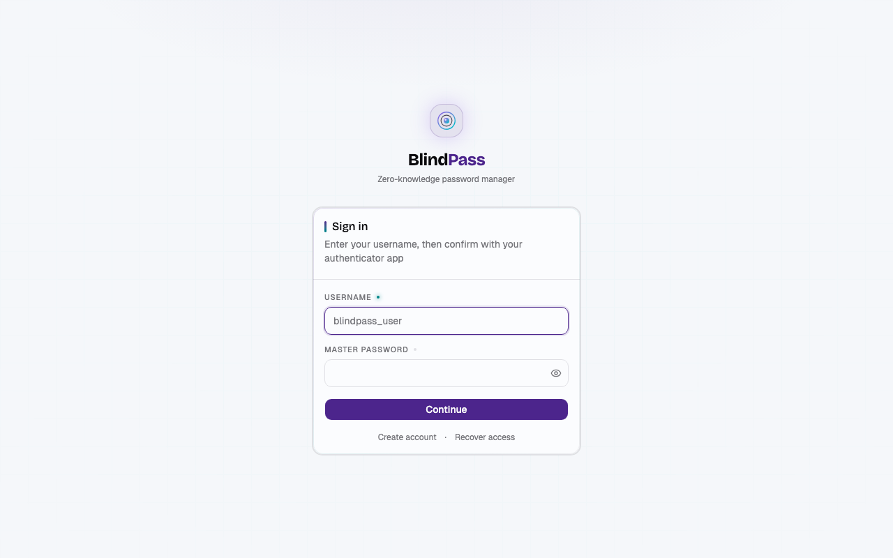
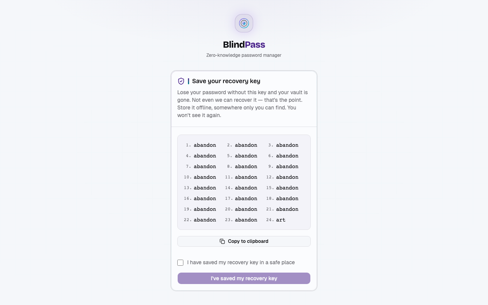
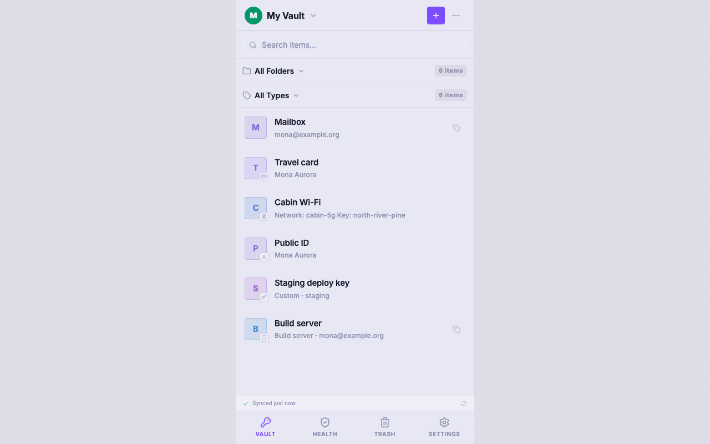
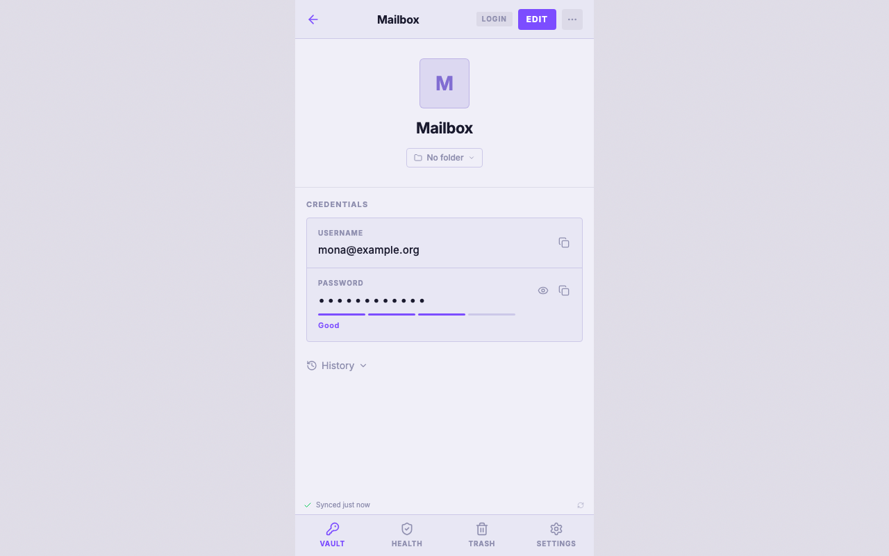
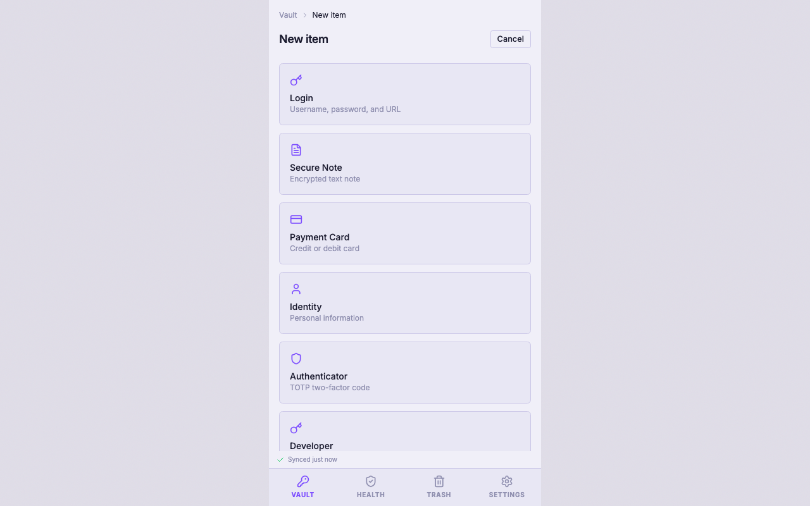
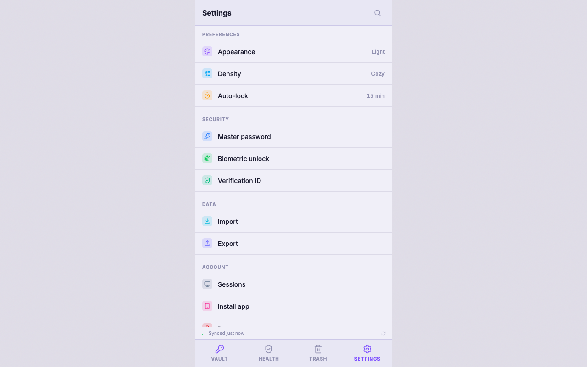

# 🔐 BlindPass

[](https://github.com/allisson/blindpass/actions/workflows/ci.yml)
[](https://nodejs.org)
[](https://pnpm.io)
[](LICENSE)
[](https://hub.docker.com/r/allisson/blindpass-server)
[](https://hub.docker.com/r/allisson/blindpass-webapp)

**Self-hostable, end-to-end encrypted password manager built around privacy by design.** Your secrets never leave your device unencrypted — the server is a cryptographically dumb blob store that never sees plaintext. Sign up with a username only — no email address, no phone number, nothing that ties your account to your real-world identity.

Four containers (Web app, Server, PostgreSQL, Redis). MIT licensed. Small enough to audit in an afternoon.

---

## Contents

- [Why BlindPass?](#-why-blindpass)
- [Screenshots](#-screenshots)
- [Features](#-features)
- [How Encryption Works](#-how-encryption-works)
- [Security](#-security)
- [Self-Hosting](#-self-hosting)
- [Local Development](#-local-development)
- [Architecture](#-architecture)
- [Troubleshooting](#-troubleshooting)
- [Contributing](#-contributing)
- [License](#-license)

---

## 🤔 Why BlindPass?

Use BlindPass when you want the operational shape of a password manager, but not the trust shape of a SaaS account. Most password managers make a reasonable trade: polished sync, recovery, sharing, support, and enterprise controls in exchange for trusting a vendor-operated identity and storage system. BlindPass chooses a narrower trade: fewer vendor conveniences, more user control.

BlindPass is for developers, sysadmins, and privacy-pragmatic operators who care about where secrets live, what identifiers exist, and how much code must be trusted. The server is a cryptographically dumb blob store. It stores ciphertext, public material, salts, and authentication state. It does not receive plaintext vault data, a master password, a master-password hash, an email address, a phone number, or billing identity.

Your master password never leaves your device. Sign-in uses your immutable username plus an authenticator-app code; your password is used only in the browser to derive a **KEK** via Argon2id. That KEK unwraps your **MasterKey**, which unwraps **VaultKeys**, which unwrap **ItemKeys**. Keys exist only in memory and are zeroed when you lock your vault.

BlindPass is MIT-licensed and self-hostable on four containers. Your data lives on your infrastructure, under your control. The codebase is intentionally small enough to audit in an afternoon: read the code, verify the crypto, run it yourself.

### What BlindPass optimizes for

- **No identity exhaust** — username-only accounts; no email, phone, billing profile, telemetry, or vendor account graph.
- **No server-side password verifier** — the server never receives your master password or a reusable master-password hash.
- **Small trust surface** — fewer product features than large suites, but less machinery between you and the crypto model.
- **Self-hosting as default posture** — four containers, no managed cloud dependency, no vendor storage backend.
- **Operator control** — export/import, delete, lock, revoke sessions, and run the whole system yourself.

### Fair comparison

Research checked May 9, 2026. "Zero knowledge" below means the vendor says vault contents are encrypted/decrypted client-side and unavailable to employees. It does not mean every product has the same metadata exposure, recovery model, sharing model, or server compromise resistance.

| Product         | Best fit                                                                      | Hosting model                                  | Source transparency                                             | Account identity         | Master password / verifier posture                                                                 | Notable strengths                                                                                                | Trade-offs vs BlindPass                                                                                                                               |
| --------------- | ----------------------------------------------------------------------------- | ---------------------------------------------- | --------------------------------------------------------------- | ------------------------ | -------------------------------------------------------------------------------------------------- | ---------------------------------------------------------------------------------------------------------------- | ----------------------------------------------------------------------------------------------------------------------------------------------------- |
| **BlindPass**   | Technical users who want self-hosted, low-identity password management        | Self-hosted by design                          | MIT-licensed repo; small audit surface                          | Username only            | Master password never leaves browser; no server-side master-password hash                          | No email identity, Argon2id browser key derivation, TOTP sign-in, encrypted import/export, simple deployment     | Younger project; fewer native clients and enterprise controls; no browser extension by design (see [ADR-0002](docs/adr/0002-no-browser-extension.md)) |
| **1Password**   | Families, teams, businesses needing polished apps and recovery/admin features | Vendor cloud membership                        | Proprietary apps with published audits and certifications       | Email/account membership | Account password plus device-generated Secret Key; 1Password says both are needed to decrypt data  | Mature apps, strong UX, Secret Key hardens weak account passwords, Watchtower, admin controls                    | Not self-hosted; 1Password 8 requires membership; email/account identity required                                                                     |
| **Bitwarden**   | Users wanting mature open source, broad clients, optional self-hosting        | Vendor cloud or supported self-host            | Open source/source available, third-party audits                | Email account            | Email + master password derive keys; Bitwarden says it never stores master password or crypto keys | Excellent client coverage, strong free/premium tiers, org sharing, self-host options including Docker/Kubernetes | Larger system to audit; self-hosting more operationally complex; email identity required                                                              |
| **Proton Pass** | Proton ecosystem users who want privacy features plus password management     | Vendor cloud                                   | Open-source apps, public audits                                 | Proton account/email     | Proton says data is end-to-end encrypted, including metadata                                       | Email aliases, Proton Sentinel, open-source clients, strong privacy brand                                        | Not self-hosted; tied to Proton account ecosystem; broader suite trust surface                                                                        |
| **KeePassXC**   | Local-first users who want no cloud account at all                            | Local encrypted file; user chooses sync method | GPLv3 open source                                               | None                     | Local database password/key file; no remote auth service                                           | Cloud-free, subscription-free, mature desktop app, ANSSI security visa                                           | No built-in managed sync/sharing/server; user owns backup/sync ergonomics                                                                             |
| **Dashlane**    | Consumers and businesses wanting polished managed security features           | Vendor cloud                                   | Client transparency and security docs; not fully open source    | Email/account            | Dashlane says vaults encrypt/decrypt locally; Argon2d key derivation documented                    | Strong UX, passkeys/passwordless options, confidential computing for some enterprise flows                       | Not self-hosted; email/account identity required; broader managed-service dependency                                                                  |
| **NordPass**    | Users wanting simple cloud sync and modern managed UX                         | Vendor cloud                                   | Proprietary with audits                                         | Email/account            | NordPass says local encryption with Argon2id-derived key and zero-knowledge architecture           | XChaCha20 positioning, breach scanner, email masking, simple apps                                                | Not self-hosted; email/account identity required; product is vendor-cloud centered                                                                    |
| **Keeper**      | Businesses needing compliance, sharing, and admin control                     | Vendor cloud                                   | Proprietary with security documentation, certifications, audits | Email/account            | Keeper says encryption/decryption happen locally and master password is not transmitted            | Enterprise controls, record-level sharing, compliance posture, secrets manager                                   | Not self-hosted for normal vault use; larger enterprise platform; email/account identity required                                                     |
| **LastPass**    | Users already in LastPass or businesses needing managed migration path        | Vendor cloud                                   | Proprietary with security documentation                         | Email/account            | LastPass says master password derives encryption/auth material; PBKDF2-SHA256 documented           | Familiar UX, business features, broad platform support                                                           | 2022 incident exposed backups containing customer vault data and metadata; not self-hosted; email/account identity required                           |

BlindPass is not trying to beat every product on feature count. 1Password, Bitwarden, Keeper, Dashlane, Proton Pass, NordPass, LastPass, and KeePassXC all have valid use cases. BlindPass exists for a narrower reason: you want a password manager whose server cannot become an identity dossier, whose storage can live on your infrastructure, and whose implementation is small enough that trust can be replaced with inspection.

Sources: [1Password security model](https://support.1password.com/1password-security/), [1Password Secret Key](https://support.1password.com/secret-key-security/), [1Password standalone vault migration](https://support.1password.com/migrate-1password-account/), [1Password audits](https://support.1password.com/security-assessments/), [Bitwarden security white paper](https://bitwarden.com/help/bitwarden-security-white-paper/), [Bitwarden self-hosting](https://bitwarden.com/help/self-host-bitwarden/), [Proton Pass security](https://proton.me/pass/security), [KeePassXC](https://keepassxc.org/), [Dashlane security](https://www.dashlane.com/security/), [Dashlane architecture](https://support.dashlane.com/hc/en-us/articles/32877446916498-3-Architecture-overview), [NordPass security](https://nordpass.com/security/), [NordPass zero-knowledge architecture](https://nordpass.com/features/zero-knowledge-architecture/), [Keeper encryption model](https://docs.keeper.io/en/v/enterprise-guide/keeper-encryption-model), [Keeper security](https://www.keepersecurity.com/en_US/security.html), [LastPass zero-knowledge model](https://www.lastpass.com/security/zero-knowledge-security), [LastPass 2022 incident notice](https://blog.lastpass.com/2022/08/notice-of-recent-security-incident/).

---

## 📸 Screenshots

|                                                                 |                                                                                    |
| :-------------------------------------------------------------: | :--------------------------------------------------------------------------------: |
|                  |  |
|                             Sign in                             |                      Recovery key reveal during registration                       |
|        |                                  |
|               Vault list with items of every type               |                                    Item detail                                     |
|  |                                 |
|                      New item type picker                       |                                      Settings                                      |

> Screenshots are captured by `make screenshots` (Playwright). The recovery key shown is the canonical all-zeros BIP39 placeholder phrase, not a real secret.

---

## ✨ Features

### Core

- 🔐 **End-to-end encrypted** — all encryption happens on your device; the server only stores ciphertext
- 🏠 **Self-hostable** — own your data, run on your own infrastructure
- 🗂 **Multiple vaults** — organize secrets into separate encrypted vaults

### Item types

- 🔑 **Login items** — username, password, URL, and notes
- 📝 **Secure notes** — encrypted freeform text (title + content)
- 💳 **Payment cards** — cardholder, number, expiry, CVV, and notes
- 🪪 **Identities** — name, address, phone, email, and company for form-filling
- ⏱ **TOTP authenticator** — issuer, secret, algorithm, digits, and period
- 🗝️ **Developer credentials** — API tokens, client/secret pairs, and SSH keypairs with structured metadata
- 🪙 **Crypto wallets** — BIP39 mnemonic seed phrases with optional network, derivation path, and passphrase

### Vault management

- 🔗 **Vault sharing** — share vaults with others via asymmetric key sealing
- 📤 **Encrypted export/import** — back up and restore your vault (BlindPass `.json` / `.blindpass` format)
- 📥 **Import from other managers** — 1Password (`.1pux`), Bitwarden (JSON), Dashlane (ZIP), LastPass (CSV), Chrome/Firefox (CSV), KeePassXC (CSV), Apple Keychain (CSV), and Proton Pass (JSON)

### Account

- 🚫 **No email required** — accounts are identified by username only; no personal information is collected or stored
- 🗝 **Recovery key** — BIP39 mnemonic to regain access if you forget your password
- 🔢 **Authenticator-based sign-in** — username + TOTP for login and sensitive actions
- 🫆 **Biometric unlock (PWA)** — opt-in per-device unlock via Touch ID, Face ID, Windows Hello, or Android biometric using WebAuthn PRF; wraps the master key locally and the server is uninvolved. On Android, only Google Password Manager currently supports the PRF extension — third-party passkey providers (Bitwarden, 1Password, …) cannot be used for biometric unlock yet (see [ADR-0003](docs/adr/0003-biometric-unlock-via-webauthn-prf.md) and the [compatibility matrix](docs/agents/biometric-compat.md))
- 🕐 **Version history** — view and restore previous versions of any item
- 🗑 **Trash & restore** — deleted items go to trash; restore or permanently purge them
- 🔄 **Password change** — re-encrypt all key material under a new master password
- 🖥 **Session management** — view all active sessions, revoke individual sessions remotely
- ❌ **Account deletion** — permanently delete your account and all associated data

### Administration

- 🛡 **Registration gate** — admin can open or close sign-ups without affecting existing accounts
- 👤 **User management** — list users, revoke sessions, or delete accounts from the admin panel
- 📊 **Vault & item quotas** — default caps (10 vaults / 1 000 items) with per-user overrides
- 💪 **Password strength gate** — registration rejects weak master passwords using `zxcvbn` entropy scoring; short or predictable passwords are blocked regardless of character composition

### Clients

- 📱 **Web app (mobile-optimized PWA)** — renders as a 430 px mobile shell on all screen sizes, optimized for the phone you are actually logging into things from; see [ADR-0004](docs/adr/0004-mobile-only-layout.md)
- 🚫 **No browser extension** — by design; see [ADR-0002](docs/adr/0002-no-browser-extension.md)

---

## 🔒 How Encryption Works

BlindPass is built on a **zero-knowledge architecture** — meaning we are technically incapable of reading your data, even if compelled to.
The cryptography architecture was inspired by [Ente's published architecture](https://ente.com/architecture/), then adapted to BlindPass's username-first account model, vault sharing flow, and self-hosted deployment target.

### Username + authenticator authentication

Sign-in uses a permanent username plus a 6-digit TOTP authenticator code. Your master password is never sent to the server — not even as a hash. It exists only in your browser, used solely to derive encryption keys.

### Login flow

```
Browser                                  Server
  │                                        │
  │  POST /auth/login/start { username }   │
  ├───────────────────────────────────────▶│  create login challenge state
  │                                        │
  │  POST /auth/login/complete             │
  │       { username, authenticatorCode }  │
  ├───────────────────────────────────────▶│  verify TOTP · create session
  │                                        │
  │◀─── 200 { message: "Authenticated" }
  │◀─── Set-Cookie: bp_session=…; HttpOnly; SameSite=Strict
  │                                        │
  │  GET /user/keys → encrypted key material
  │  Argon2id(password, kekSalt) → KEK
  │  decrypt(encryptedMasterKey) → masterKey  [memory only]
  │  decrypt(encryptedVaultKey)  → vaultKey   [memory only]
```

The session cookie is `HttpOnly` — JavaScript on the page cannot read it. The server stores only the SHA-256 hash of the token, never the token itself. On a page reload, you re-enter your master password to re-derive keys; no OTP is required.

### Your password never leaves your device

When you log in, BlindPass uses **Argon2id** — a memory-hard key derivation function designed to resist GPU and ASIC brute-force attacks — to derive a Key Encryption Key (KEK) from your master password. This derivation happens entirely in your browser. Your password is never sent over the network.

### A layered key hierarchy

Each layer of encryption uses a unique key, so compromising one layer doesn't expose another:

```
your password
  └─ Argon2id(password, kekSalt) → keyEncryptionKey (KEK)
       └─ decrypt(encryptedMasterKey) → masterKey
            ├─ decrypt(encryptedPrivateKey) → privateKey  (used for vault sharing)
            ├─ decrypt(encryptedRecoveryKey) → recoveryKey (BIP39 mnemonic)
            └─ decrypt(encryptedVaultKey) → vaultKey
                 └─ decrypt(encryptedItemKey) → itemKey
                      └─ decrypt(encryptedBlob) → your plaintext secret
```

All keys live **in memory only** and are zeroed out when you lock your vault or close the tab. The one exception is opt-in **Biometric unlock** (per device): when enabled, the master key is stored on the device's IndexedDB wrapped by a per-credential WebAuthn PRF secret that only the platform authenticator (Touch ID, Face ID, Windows Hello, Android biometric) can release. See "What lives in your browser" below.

### What the server actually stores

| Stored on server (plaintext)             | Never stored on server  |
| ---------------------------------------- | ----------------------- |
| Username                                 | Your master password    |
| Public key (for vault sharing)           | Any plaintext secret    |
| KDF parameters (salt, Argon2id params)   | Vault keys or item keys |
| Encrypted key material (ciphertext only) | Your private key        |

### Vault sharing

To share a vault, the sender seals the vault key with the recipient's **X25519 public key**. The server looks up the recipient's public key by username. Only the intended recipient — holding the corresponding private key — can unseal and access the vault. The server cannot read the vault key at any point.

### Recovery key

At registration, BlindPass generates a **BIP39 mnemonic phrase** (256-bit entropy) and encrypts it under your master key. If you forget your password, use this phrase to regain access. It is shown once at account creation — store it somewhere safe and offline.

### Cryptographic primitives

All crypto uses **[libsodium](https://libsodium.org)**, a battle-tested, audited library:

- **Key derivation:** Argon2id
- **Symmetric encryption:** XSalsa20-Poly1305
- **Asymmetric encryption (vault sharing):** X25519 + XSalsa20-Poly1305
- **Recovery key:** BIP39 mnemonic (256-bit entropy)

---

## 🛡 Security

### Threat model

| Threat                                | Status          | Notes                                                                                                                                                                                                                                                                                                                        |
| ------------------------------------- | --------------- | ---------------------------------------------------------------------------------------------------------------------------------------------------------------------------------------------------------------------------------------------------------------------------------------------------------------------------- |
| Server compromise                     | ✅ Protected    | Server stores only ciphertext — no keys, no plaintext                                                                                                                                                                                                                                                                        |
| Network interception                  | ✅ Protected    | All data encrypted client-side before transmission                                                                                                                                                                                                                                                                           |
| Brute-force via server                | ✅ Protected    | No server-side password verifier or password hash to attack                                                                                                                                                                                                                                                                  |
| Weak master password                  | ⚠️ Partial      | Argon2id hardens derivation; a weak password is still a weak password                                                                                                                                                                                                                                                        |
| Forgotten password                    | ✅ Mitigated    | BIP39 recovery key generated at registration                                                                                                                                                                                                                                                                                 |
| Malware on your device                | ❌ Out of scope | Client-side malware can read in-memory keys                                                                                                                                                                                                                                                                                  |
| Phishing / social engineering         | ❌ Out of scope | No technical control can prevent this                                                                                                                                                                                                                                                                                        |
| Browser extension surface             | ❌ Not shipped  | No autofill or capture extension by design — see [ADR-0002](docs/adr/0002-no-browser-extension.md)                                                                                                                                                                                                                           |
| Local device theft + biometric bypass | ⚠️ Partial      | When **Biometric unlock** is enabled, an attacker with physical device access who can defeat the chosen passkey provider's biometric gate (Touch ID / Face ID / Windows Hello / Google Password Manager on Android) can decrypt the wrapped master key on disk. Disable biometric unlock in Settings to remove this surface. |

### Session security

| Property       | Value                                                          | Why it matters                                                                 |
| -------------- | -------------------------------------------------------------- | ------------------------------------------------------------------------------ |
| Cookie flags   | `HttpOnly; Secure; SameSite=Strict`                            | JavaScript cannot read the session token; CSRF is blocked at the browser level |
| Server storage | SHA-256 hash of token only                                     | A database breach does not expose valid tokens                                 |
| CSRF defense   | `SameSite=Strict` + required `x-bp-client` header on mutations | Two independent layers; a weakened SameSite assumption alone is not enough     |
| Session TTL    | 14 days absolute, 7 days idle                                  | Both must hold; idle-only activity cannot extend indefinitely                  |

### What lives in your browser

BlindPass follows a strict client storage policy — key material is never written to disk unless **Biometric unlock** is explicitly enabled on this device:

| Storage                           | What is stored                                                                                                    | When wiped                                                                         |
| --------------------------------- | ----------------------------------------------------------------------------------------------------------------- | ---------------------------------------------------------------------------------- |
| Memory only                       | `masterKey`, `vaultKey`, `itemKey`, `privateKey`                                                                  | Lock, logout, or tab close                                                         |
| IndexedDB (`bp:vault-cache`)      | Encrypted vault items (ciphertext only, no keys)                                                                  | Lock and logout                                                                    |
| IndexedDB (`bp:biometric-unlock`) | Wrapped master key + WebAuthn credential ID + PRF salt (only when **Biometric unlock** is enabled on this device) | Logout, session expiry, or explicit disenrollment in Settings (survives idle lock) |
| `localStorage`                    | Username pre-fill, theme, density preference                                                                      | Never (non-sensitive)                                                              |

An XSS attack that can run JavaScript in the page **cannot** read the session cookie, the master key, or any vault key. The worst it can do is read the IndexedDB cache — which is ciphertext.

---

## 🚀 Self-Hosting

### Requirements

- Docker and Docker Compose

### Setup

1. Download the compose file and configure:

   ```bash
   curl -o docker-compose.yml https://raw.githubusercontent.com/blindpass/blindpass/main/docker-compose.prod.yml
   curl -o .env.example https://raw.githubusercontent.com/blindpass/blindpass/main/.env.example
   cp .env.example .env
   ```

   Edit `.env` with your values (see the full variable reference below).

   > **Security:** The example `DATABASE_URL` uses the password `blindpass`. Change it before deploying to any non-local environment.

   Generate a base64 32-byte authenticator-secret key for the server:

   ```
   TOTP_SECRET_ENCRYPTION_KEY=$(openssl rand -base64 32)
   ```

2. Pull images and start all services:

   ```bash
   docker compose up -d
   ```

   No build step required — prebuilt images are pulled automatically from Docker Hub (`allisson/blindpass-server`, `allisson/blindpass-webapp`).

The web app is served on port **8000** (HTTP). Point a reverse proxy at that port to terminate TLS — see [docs/deployment/reverse-proxy.md](docs/deployment/reverse-proxy.md) for Caddy and nginx setup guides.

Verify the stack is running:

```bash
curl http://localhost:8000/health
# {"status":"ok","db":"ok"}
```

### First-time setup

Open the web app and register an account. **The first registration always becomes the Admin User**, regardless of whether the registration gate is open or closed.

As admin, visit `/admin` to:

- Open or close the **registration gate** — controls whether new users can sign up
- View and revoke user access
- Adjust default quotas (defaults: 10 vaults per user, 1 000 items per vault)

### Updating

```bash
docker compose pull
docker compose up -d
```

### Environment Variables

| Variable                     | Required      | Default                 | Description                                                                     |
| ---------------------------- | ------------- | ----------------------- | ------------------------------------------------------------------------------- |
| `DATABASE_URL`               | Yes           | —                       | PostgreSQL connection URL                                                       |
| `POSTGRES_PASSWORD`          | Yes (compose) | —                       | PostgreSQL superuser password for the `db` container; must match `DATABASE_URL` |
| `TOTP_SECRET_ENCRYPTION_KEY` | Yes           | —                       | Base64-encoded 32-byte key for encrypting stored authenticator secrets          |
| `REDIS_URL`                  | Yes (prod)    | —                       | Redis connection URL for server-side session storage                            |
| `NODE_ENV`                   | Yes           | —                       | Must be `production` in production                                              |
| `CORS_ORIGIN`                | Yes (prod)    | `http://localhost:5173` | Allowed origin(s), comma-separated                                              |
| `PORT`                       | No            | `3000`                  | HTTP server port                                                                |
| `LOG_LEVEL`                  | No            | `info`                  | Pino log level (`trace`/`debug`/`info`/`warn`/`error`)                          |
| `COOKIE_DOMAIN`              | No            | —                       | Cookie domain (set when web app and API share a domain)                         |
| `COOKIE_NAME`                | No            | `bp_session`            | Session cookie name                                                             |
| `COOKIE_SECURE`              | No            | `true`                  | Must remain `true` in production                                                |
| `SESSION_TTL_MS`             | No            | `1209600000` (14 days)  | Absolute session expiry                                                         |
| `SESSION_IDLE_TTL_MS`        | No            | `604800000` (7 days)    | Idle session expiry; must be ≤ `SESSION_TTL_MS`                                 |
| `BODY_LIMIT_BYTES`           | No            | `524288` (512 KB)       | Maximum request body size                                                       |
| `DB_POOL_MAX`                | No            | `10`                    | Maximum PostgreSQL connection pool size                                         |
| `PENDING_TOTP_TTL_MS`        | No            | `900000` (15 min)       | How long a TOTP setup challenge remains valid                                   |
| `RECOVERY_TOKEN_TTL_MS`      | No            | `900000` (15 min)       | How long a recovery token remains valid                                         |
| `UNVERIFIED_ACCOUNT_TTL_MS`  | No            | `86400000` (24 h)       | How long an unverified account is retained before cleanup                       |
| `EXPOSE_DOCS`                | No            | `false`                 | Enable Swagger UI at `/docs`                                                    |

### Self-Hosting on GCP Cloud Run (free tier)

Run BlindPass on [GCP Cloud Run](https://cloud.google.com/run) with external managed services — no VM to operate.

| Component | Provider                                   | Free tier                             |
| --------- | ------------------------------------------ | ------------------------------------- |
| Web + API | GCP Cloud Run                              | 2M req/month, 360K vCPU-seconds/month |
| Database  | [Supabase](https://supabase.com) free tier | 500 MB, paused after 1 week idle      |
| Redis     | [Upstash](https://upstash.com) free tier   | 10K commands/day                      |
| TLS + DNS | Cloud Run domain mapping                   | Free managed certificate              |

See **[terraform/README.md](terraform/README.md)** for the full quickstart.

---

## 🛠 Local Development

### Requirements

- Node.js 24
- pnpm 10
- Docker (for PostgreSQL)

### Setup

```bash
pnpm install
make dev
```

`make dev` starts PostgreSQL via Docker Compose and runs all apps in watch mode.

| Service    | URL                   |
| ---------- | --------------------- |
| Web app    | http://localhost:5173 |
| API server | http://localhost:3000 |

### Commands

```bash
make dev                      # start all services and apps
make test                     # run all tests
make test:crypto              # packages/crypto only (≥95% coverage gate)
make test:server:unit         # server unit tests
make test:server:integration  # server integration tests (requires Docker)
make test:e2e                 # e2e tests (requires make dev running)
make lint                     # eslint via turbo
make format                   # prettier --write
make ci                       # lint + tsc + format check + test
make db:migrate               # run pending migrations
make db:studio                # open Drizzle Studio
make screenshots              # capture UI screenshots to docs/screenshots/
make prod:build               # build production Docker images (contributors only)
make prod:up                  # start production stack
make prod:down                # stop production stack
make prod:logs                # tail production logs
```

---

## 🏗 Architecture

BlindPass is a pnpm monorepo with separate web, server, and shared package boundaries. Its zero-knowledge cryptography architecture was inspired by [Ente's published architecture](https://ente.com/architecture/).

```
┌──────────────────────────────────────────────┐
│                   Browser                    │
│           ┌──────────────┐                   │
│           │   apps/web   │                   │
│           └──────┬───────┘                   │
│           ┌──────▼──────────┐                │
│           │ packages/vault  │◄── packages/   │
│           │ (domain logic)  │    crypto      │
│           └──────┬──────────┘                │
└──────────────────┼───────────────────────────┘
                   │ HTTPS (encrypted blobs only)
            ┌──────▼──────┐
            │ apps/server │  Fastify REST API
            └──────┬──────┘
       ┌───────────┴───────────┐
  ┌────▼────┐           ┌──────▼──────┐
  │  Redis  │  sessions │  PostgreSQL │  ciphertext
  └─────────┘           └─────────────┘
```

### Packages

| Package               | Role                                                                                                                                              |
| --------------------- | ------------------------------------------------------------------------------------------------------------------------------------------------- |
| `packages/crypto`     | Pure libsodium primitives — Argon2id, XSalsa20-Poly1305, X25519, BIP39. No I/O, no state, no side effects.                                        |
| `packages/vault`      | Domain logic — encrypts/decrypts items, manages the keychain lifecycle (unlock/lock), handles vault sharing. Imports only from `packages/crypto`. |
| `packages/api-schema` | Zod schemas for every API endpoint, shared between server and clients so validation stays in sync.                                                |

### Tech Stack

| Layer    | Technology                                                         |
| -------- | ------------------------------------------------------------------ |
| Runtime  | Node.js 24, pnpm 10                                                |
| Backend  | Fastify, Drizzle ORM, PostgreSQL 16                                |
| Frontend | React 19, TanStack Router, Vite, Tailwind, shadcn/ui               |
| Crypto   | libsodium-wrappers-sumo, @scure/bip39                              |
| Testing  | Vitest (unit + integration), real PostgreSQL for integration tests |
| Build    | Turborepo, Vite, esbuild                                           |

---

## 🛟 Troubleshooting

**`make dev` fails immediately**
Docker must be running before starting. Start Docker Desktop (or your Docker daemon) and retry.

**Port 5432 already in use**
A local PostgreSQL instance is occupying the port. Stop it (`brew services stop postgresql` on macOS) or change the mapped port in `docker-compose.yml`.

**`make test:server:integration` fails**
Integration tests require Docker to be running (they spin up a real PostgreSQL container). Ensure Docker is available and no other process holds port 5432.

**`libsodium` import errors in tests**
`packages/crypto` must never be mocked. Always run tests against the real libsodium binding. If you see import errors, verify `libsodium-wrappers-sumo` is installed (`pnpm install`).

---

## 🤝 Contributing

1. Fork the repo and create a branch from `main`
2. Run `make ci` before opening a PR (lint + type check + tests must pass)
3. All new code requires tests written alongside or before implementation (TDD)
4. `packages/crypto` enforces ≥95% coverage — do not drop below it
5. Never mock `packages/crypto` in tests — always test against real libsodium

---

## 📄 License

MIT — see [LICENSE](LICENSE).
